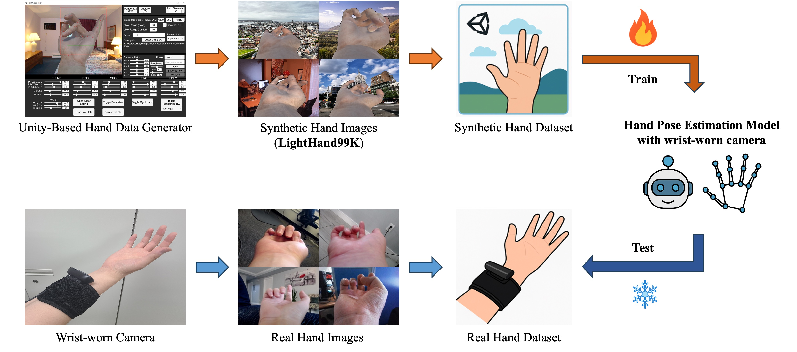
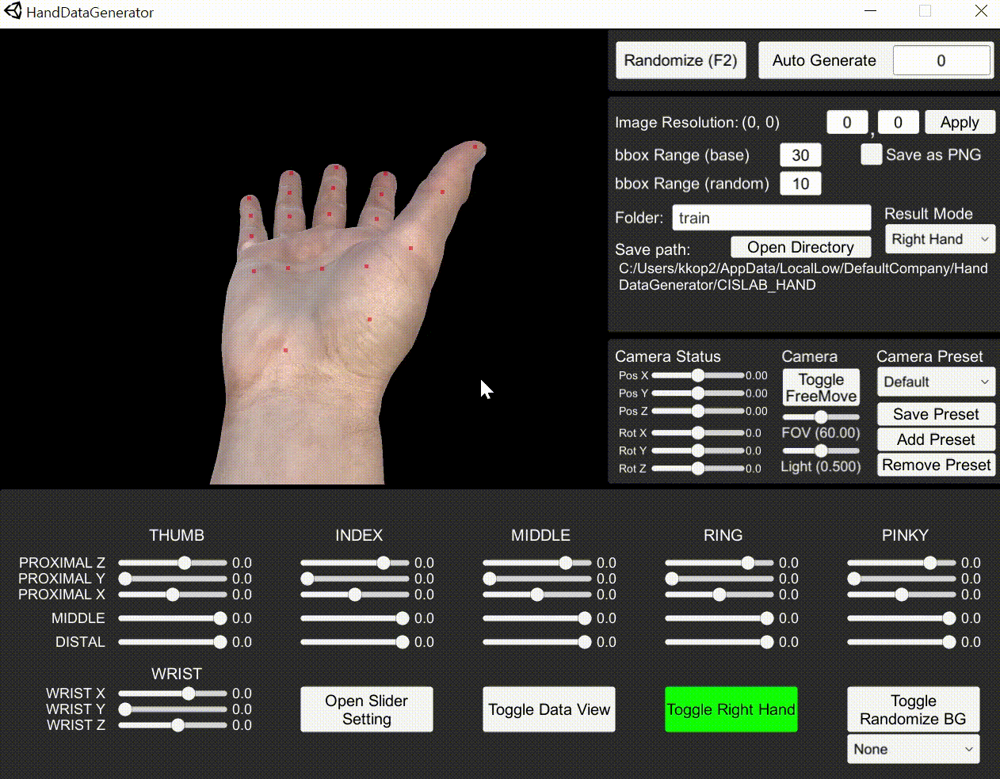
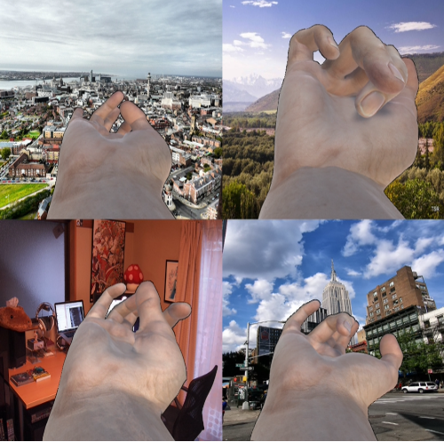
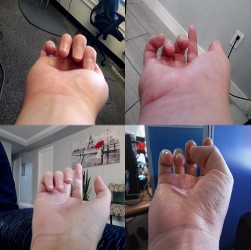

# LightHand99K: A Synthetic Dataset for Hand Pose Estimation with Wrist-Worn Cameras

[](https://ieeexplore.ieee.org/document/10988778)
[](https://mlpa503.synology.me:15051/d/s/12hOp2DNKaj6DYBP2liU5FE5lAHWP5RU/Ysq8OKrh58lkMVaxg31D9U_ssYhpk4Mu-FrUg33yBSAw)
[-red)](https://gofile.me/7wbhv/1njPve4X4)
[-red)](https://mlpa503.synology.me:15051/d/s/10ubD0JMn8WdYmtNjgdUfKkY6M8Xg2un/V3bA-avaSff4AshI9D79reY5LKFg0HVB-RLYAptGCSAw)

<p align="left">
    
</p>

Code repository for the paper: **"LightHand99K: A Synthetic Dataset for Hand Pose Estimation with Wrist-Worn Cameras"**, published in *IEEE Access* 2025

**Authors:** Jeongho Lee¹, Changho Kim¹, Jaeyun Kim¹, Seon Ho Kim², Younggeun Choi¹, Sang-Il Choi¹

¹ Dankook University, South Korea <br>
² University of Southern California, United States

---

## 🔍 Overview

**LightHand99K** is a large-scale synthetic dataset specifically designed for training and evaluating hand pose estimation models from **wrist-worn camera perspectives**. It contains **99,792 photorealistic RGB hand images** with precise 2D annotations and is generated using a Unity-based renderer.

---

## ✨ Key Features

* 🖐️ **99K+ wrist-perspective RGB hand images**
* 👤 Diverse pose types including occlusions by pinky, thumb, or both
* 🌟 High-resolution rendering with real-world backgrounds
* 🛠️ Unity-based generator with full control camera angle and random pose
* 🔄 Compatible with top-down 2D pose estimation pipelines

---

## 📂 Dataset Contents

### 🏷️ Annotation includes:

* RGB image
* 2D keypoints for 21 hand joints

> ⚠️ Note: Only **2D keypoints** are provided in the public dataset because they are used for training. However, **3D world coordinates** and **camera parameters** can be accessed through the generator program, allowing users to customize and extract more information as needed.

### 🔧 Additional Available Data (via generator program)

* 3D world coordinates for 21 hand joints
* Camera intrinsic, extrinsic parameters, principle points
* Metadata

---

## 🧰 Tool Examples

### Randomize background OFF

<p align="left">
    
</p>

### Randomized background ON

<p align="left">
    
</p>

---

## 🧪 Dataset Examples

### Training set (**LightHand99K**)

<p align="left">
    
</p>

### Evaluation set (Real)

<p align="left">
    
</p>

---

## 📊 Benchmark Results

| Model          | Dataset      | AUC (↑)  | EPE (↓ mm) |
| -------------- | ------------ | -------- | ---------- |
| SimpleBaseline | LightHand99K | **90.4** | **3.3**    |
| HRNet          | LightHand99K | **83.5** | **4.3**    |
| FreiHAND       | Real Dataset | 64.4     | 7.1        |
| RHD            | Synthetic    | 59.0     | 8.2        |

---

## 🛠️ Unity Generator Highlights

* Valid joint angle controlled by constraints
* Camera preset selection (side, top, front)
* Desired background image

---

## 🗂 Directory Structure

Build your project using the following structure:

```bash
{$ROOT}
├── src
│   └─ tools
│       └─ train.py
├── datasets
│   └─ freihand
│   └─ LightHand99K
│   └─ Etc.
└── models
    └─ hrnet
    └─ simplebaseline
```

---

## 🧠 Download

All dataset links require a password, so feel free to contact me at [72210297@dankook.ac.kr](mailto:72210297@dankook.ac.kr) if you need access.

### 🏃‍♂️ Training

```bash
cd {$ROOT}/src/tools
python hrnet/frei/2d  # example
```

### ⚙️ Training Arguments

```bash
--name hrnet/frei/2d --epoch 100 --count 5 --reset
```

* `count`: stop if valid loss doesn't improve after 5 epochs
* `--reset`: skip checkpoint loading (fresh start)

---

## 📄 Citation

Please cite this paper if you use the dataset or generator:

```bibtex
@ARTICLE{10988778,
  author={Lee, Jeongho and Kim, Changho and Kim, Jaeyun and Kim, Seon Ho and Choi, Younggeun and Choi, Sang-Il},
  journal={IEEE Access}, 
  title={LightHand99K: A Synthetic Dataset for Hand Pose Estimation With Wrist-Worn Cameras}, 
  year={2025},
  volume={13},
  number={},
  pages={81423-81433},
  keywords={Hands;Cameras;Three-dimensional displays;Generators;Solid modeling;Pose estimation;Lighting;Graphical user interfaces;Accuracy;Training;Data augmentation;deep learning;hand data generator;hand pose estimation;RGB hand images;synthetic dataset;wrist-worn camera},
  doi={10.1109/ACCESS.2025.3567313}}

```

---

## 📧 Contact

> Dankook University, Korea <br>
> Ph.D program, Department in Computer Science <br>
> Jeongho Lee: [72210297@dankook.ac.kr](mailto:72210297@dankook.ac.kr)
