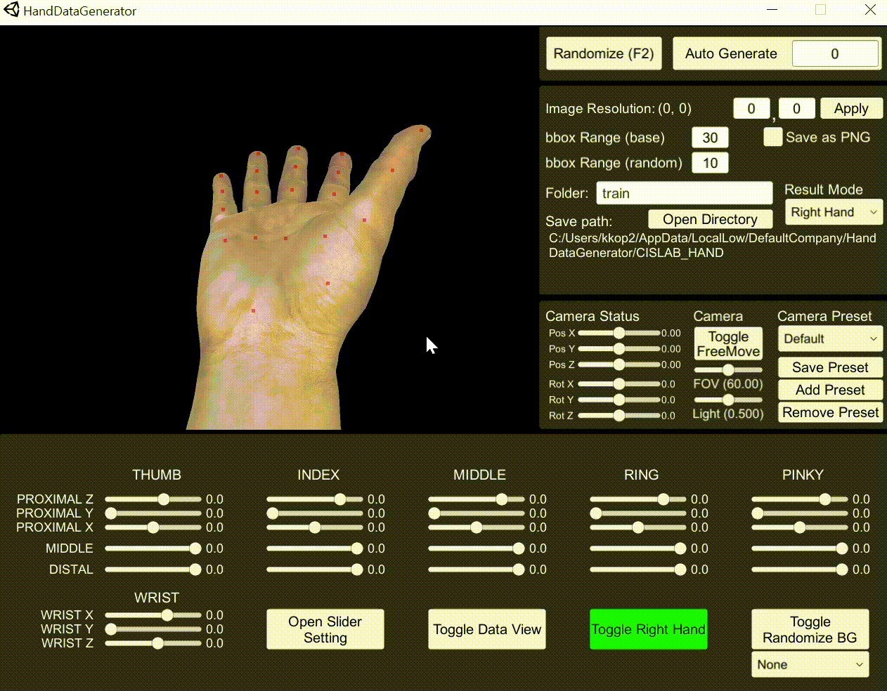
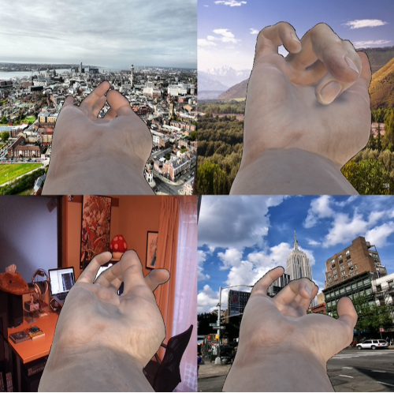
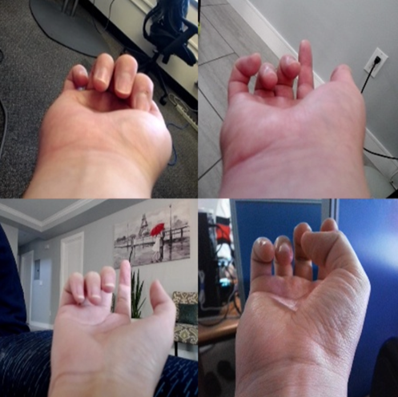

# LightHand

## Tool

### Randomize background OFF
<p align="left">
    
</p>

</br>

### Randomized background ON
<p align="left">
    
</p>

### Download [[HERE](https://mlpa503.synology.me:15051/d/s/11e8WJFEehEJ8oO47O7LUuzq48naY9QX/6tU9h8kmIua_9586DLbZquVvTmS7gAi8-X78AAzEG9Qs)]

</br>

## Dataset
### Training set
<p align="left">
    
</p>

</br>

### Evaluation set
<p align="left">
    
</p>

### Download [[HERE]([https://mlpa503.synology.me:15051/d/s/11e8Wfd8LCZhQSxOlebul6ZF5dgUJuyj/jNhhV4wX7nsFcCEMthz8s7fH19lYSl0f-er5APyUF9Qs](https://mlpa503.synology.me:15051/d/s/11e8C9aU6h8zlSqOdMqodkHMyvnRYddv/kuAILF61CCVg9DVR48jDnjfrxVQQ1HYr-DbPg8XIXKgw))]

## Directory</br>
Build as the below architecture 
```
{$ROOT}
├── build
├── src
├── datasets
│   └─ freihand
│   └─ LigthHand99K
│   └─ Etc.
└── models
    └─ hrnet
    └─ simplebaseline

```


## Train
```
cd {$ROOT}/src/tools
python model_name/dataset_name/name
ex) python hrnet/frei/2d
```

## Args
you can change the epoch, count, init through arg command line
ex. python --name hrnet/frei/2d --epoch 100 --count 5 --reset

1. count means to stop the training when valid loss don't fall after series of 5 epoch

2. It saves automatically the check-point.pth whenever valid loss fall.
Thus if you don't want to resume the check-point, insert "--reset"
