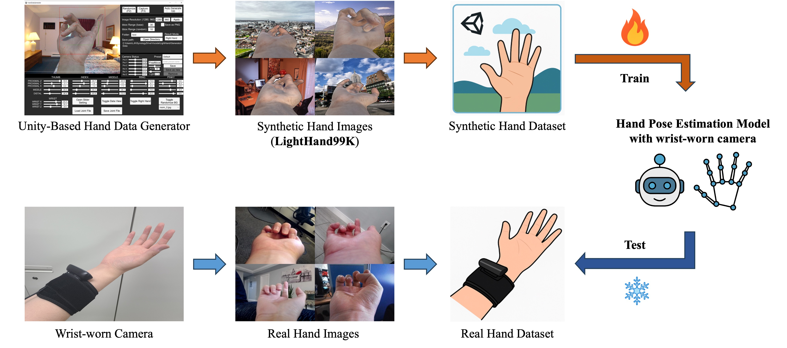
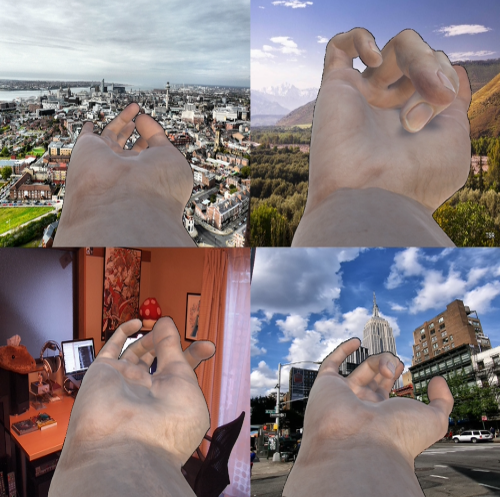
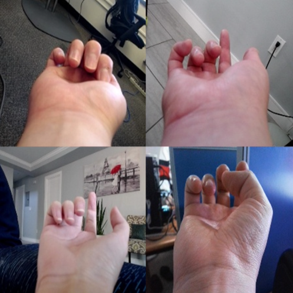
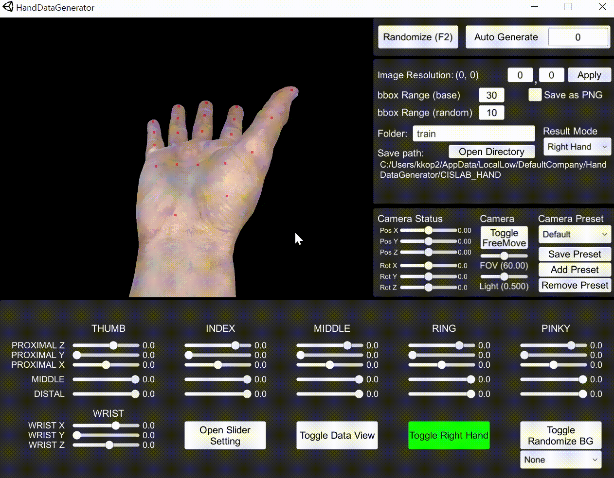

<div align="center">

# LightHand99K

### A Synthetic Dataset for Hand Pose Estimation with Wrist-Worn Cameras

[](https://ieeexplore.ieee.org/document/10988778)
[](https://github.com/leejeongho3214/SHaF)
[](mailto:72210297@dankook.ac.kr)

**Jeongho Lee**¹ · Changho Kim¹ · Jaeyun Kim¹ · Seon Ho Kim² · Younggeun Choi¹ · Sang-Il Choi¹

¹ Dankook University, South Korea &nbsp;&nbsp;·&nbsp;&nbsp; ² University of Southern California, United States



</div>

---

## 📌 Overview

Wrist-worn cameras see the hand from an angle almost no public dataset covers — extreme foreshortening, self-occlusion by the thumb and pinky, and a viewpoint that shifts with the wrist itself. **LightHand99K** fills that gap with **99,792 photorealistic RGB hand images** rendered from the wrist perspective in Unity, each annotated with 2D keypoints for all 21 hand joints.

The dataset ships together with the **Unity generator** that produced it, so the camera rig, hand poses and backgrounds can be re-configured and re-rendered for a different wrist-worn device rather than being fixed at ours.

> [!NOTE]
> **[2025-07-05] Generator update** — a bug affecting image saving has been fixed; please re-download the generator below. The **Capture** button has been removed; the current workflow is documented in [Generating your own data](#-generating-your-own-data).

---

## 📥 Downloads

| Resource | Contents | Link |
| --- | --- | --- |
| **Generator** | Unity tool — render your own images, export 3D coordinates and camera parameters | [Download](https://drive.mlpa503.synology.me/d/s/143Fz7mIZ8gCBHX65gt3fV7aFuRO9euh/6msd-oCNGlOFZK1iwFi9_Mteva4UVnY5-a7CgwwGxaAw) |
| **Dataset — test** | Real wrist-camera evaluation set | [Download](https://drive.mlpa503.synology.me/d/s/10ubD0JMn8WdYmtNjgdUfKkY6M8Xg2un/V3bA-avaSff4AshI9D79reY5LKFg0HVB-RLYAptGCSAw) |

> 🔑 All archives are password-protected. Email [72210297@dankook.ac.kr](mailto:72210297@dankook.ac.kr) for the credentials.

---

## 🖐️ Dataset

| Property | Value |
| --- | --- |
| Images | **99,792** photorealistic RGB |
| Viewpoint | Wrist-worn camera |
| Annotation | 2D keypoints, 21 hand joints |
| Pose variation | Includes occlusion by thumb, pinky, or both |
| Backgrounds | Real-world images, randomizable |
| Renderer | Unity |

**Public release vs. generator output**

| | 2D keypoints | 3D world coordinates | Camera intrinsics / extrinsics / principal point | Metadata |
| --- | :---: | :---: | :---: | :---: |
| Downloadable dataset | ✅ | — | — | — |
| Generated yourself | ✅ | ✅ | ✅ | ✅ |

The published archive carries 2D keypoints only. Everything else is available if you render the data yourself with the generator — which is the intended path when your camera geometry differs from ours.

<div align="center">
  
  <br><sub><b>Training set</b> — LightHand99K (synthetic)</sub>
  <br><br>
  
  <br><sub><b>Evaluation set</b> — real wrist-camera captures</sub>
</div>

---

## 🎮 Generating Your Own Data

<div align="center">
  <table>
    <tr>
      <td align="center"><b>Randomize background — OFF</b></td>
      <td align="center"><b>Randomize background — ON</b></td>
    </tr>
    <tr>
      <td></td>
      <td></td>
    </tr>
  </table>
</div>

**What the generator gives you**

- Anatomically valid poses — joint angles are constrained to biomechanical ranges
- Camera presets for side, top and front views, plus free-flight positioning
- Custom background images
- Full annotation export: 3D joint coordinates, camera parameters, metadata

### Camera controls

Enable **FreeMove** to take manual control of the camera.

| Input | Action |
| --- | --- |
| `W` `A` `S` `D` | Move forward / left / backward / right |
| `Q` `E` | Move down / up |
| `Shift` (hold) | Increase movement speed |
| Right-mouse drag | Rotate the camera |
| Scroll wheel | Zoom in / out (adjusts FOV) |

### Preset workflow

1. Position the camera at a viewpoint you want, then **save it as a preset**.
2. Repeat until you have covered the viewpoints your device needs.
3. Render with either:
   - **Auto Generate** — enter an image count and let it run across all presets, or
   - **Randomize** — shuffle the pose and capture the results you like.

---

## 📊 Benchmark

2D hand pose estimation on the real wrist-camera evaluation set. **AUC** of the PCK curve (higher is better) and **EPE** in millimetres (lower is better).

| Training data | Model | AUC ↑ | EPE ↓ (mm) |
| --- | --- | --- | --- |
| **LightHand99K** | SimpleBaseline | **90.4** | **3.3** |
| **LightHand99K** | HRNet | **83.5** | **4.3** |
| FreiHAND (real) | — | 64.4 | 7.1 |
| RHD (synthetic) | — | 59.0 | 8.2 |

Models trained on LightHand99K transfer to real wrist-camera footage far better than those trained on existing real or synthetic sets — the viewpoint match matters more than photorealism alone.

---

## 🚀 Getting Started

### 1. Environment

```bash
git clone https://github.com/leejeongho3214/LightHand.git
cd LightHand

conda env create -f requirements.yaml   # creates the "Pose" environment
conda activate Pose
```

### 2. Expected layout

```
{$ROOT}
├── assets/                 # figures used in this README
├── src/
│   ├── modeling/           # HRNet, SimpleBaseline
│   ├── utils/              # argparser, losses, metrics, dataloaders
│   └── tools/
│       ├── train.py
│       ├── wearable_eval_2d.py
│       ├── dataset.py
│       └── processing_aug.py
├── datasets/               # ← place your data here
│   ├── LightHand99K/
│   ├── freihand/
│   └── ...
├── models/                 # ← pretrained backbones
│   ├── hrnet/
│   └── simplebaseline/
└── requirements.yaml
```

### 3. Train

```bash
cd src/tools
python train.py --root simplebaseline/ours --name my_run --epoch 100 --count 30
```

`--root` follows the pattern `<backbone>/<dataset-key>`; the dataset key is taken from the last path segment, and checkpoints are written under `<--root_path>/<--root>/<--name>`.

**Dataset keys**

| Key | Dataset |
| --- | --- |
| `ours` | LightHand99K |
| `frei` | FreiHAND |
| `interhand` | InterHand |
| `rhd` | RHD |
| `gan` | GANerated Hands |

<details>
<summary><b>All training options</b></summary>

<br>

| Option | Default | Description |
| --- | --- | --- |
| `--root` | `simplebaseline/ours` | `<backbone>/<dataset-key>` — also determines `--dataset` |
| `--name` | `84k` | Run name; checkpoint and log folder |
| `--root_path` | `output` | Root directory for all outputs |
| `--model` | `ours` | Model variant |
| `--view` | `wrist` | Camera viewpoint of the data |
| `--epoch` | `100` | Maximum epochs |
| `--batch_size` | `32` | Batch size |
| `--lr` | `0.001` | Learning rate |
| `--milestone` | `10` | LR schedule milestone |
| `--count` | `30` | Early stopping — stop after N epochs without validation improvement |
| `--num_our` | `300000` | How many LightHand images to draw for training |
| `--ratio_of_other` | `0` | Fraction of an additional dataset to mix in |
| `--ratio_of_aug` | `0.6` | Fraction of training images to augment |
| `--color` | off | Apply color jitter (uses `--ratio_of_aug`) |
| `--rot` | off | Apply rotation augmentation |
| `--scale` | off | Apply scale augmentation |
| `--D3` | off | Predict 3D joint coordinates instead of 2D |
| `--transfer` | off | Fine-tune from a pretrained checkpoint |
| `--optim` | off | Restore optimizer state when resuming |
| `--reset` | off | Ignore any existing checkpoint and start fresh |
| `--eval` / `--test` | off | Evaluation / test mode |
| `--plt` | off | Save prediction plots |
| `--logger` | off | Enable file logging |

</details>

### 4. Evaluate

```bash
cd src/tools
python wearable_eval_2d.py --root simplebaseline/ours --name my_run
```

---

## 📖 Citation

```bibtex
@article{lee2025lighthand99k,
  title   = {LightHand99K: A Synthetic Dataset for Hand Pose Estimation
             With Wrist-Worn Cameras},
  author  = {Lee, Jeongho and Kim, Changho and Kim, Jaeyun and Kim, Seon Ho
             and Choi, Younggeun and Choi, Sang-Il},
  journal = {IEEE Access},
  volume  = {13},
  pages   = {81423--81433},
  year    = {2025},
  doi     = {10.1109/ACCESS.2025.3567313}
}
```

---

## 🔗 Related Work

| Year | Venue | Project |
| --- | --- | --- |
| 2025 | IEEE Access | **LightHand99K** — this repository |
| 2024 | Applied Intelligence | [**SHaF** — synthetic hand dataset including a forearm](https://github.com/leejeongho3214/SHaF) |

---

## 📬 Contact

> Ph.D. Program, Department of Computer Science
> Dankook University, South Korea
> **Jeongho Lee** · 📧 [72210297@dankook.ac.kr](mailto:72210297@dankook.ac.kr)
